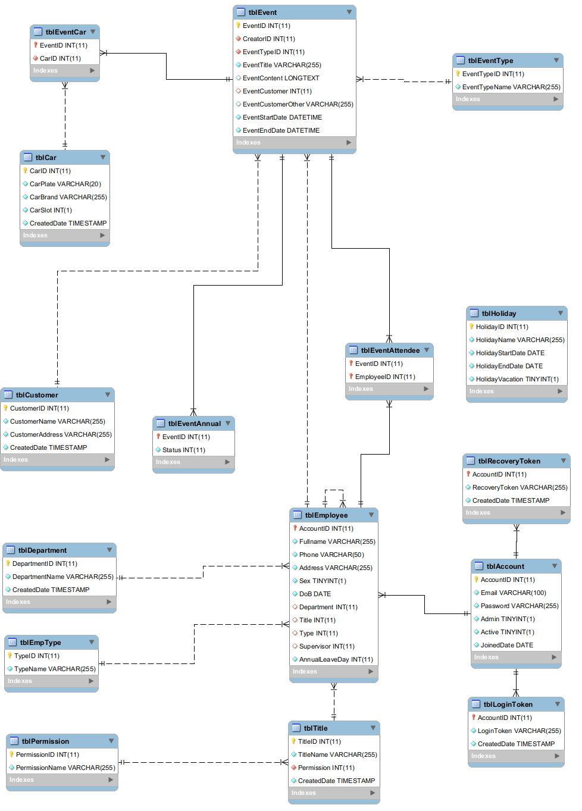

# SNA CALENDAR

Web application for manage working calendar, customers, departments, employees...

***

## TECHNOLOGY

### Frontend

Html5

CSS3 with Framework/Plugin

* [Bootstrap 3](https://getbootstrap.com/docs/3.3/) - The web framework used
* [Fontawesome 5](https://fontawesome.com/) - Icon set

JS with Framework/Plugin
* [JQuery](https://jquery.com/) - JavaScript library (v2.2.3)
* [Animate](https://daneden.github.io/animate.css/) - Animation plugin of Daniel Eden
* [Bootstrap-calendar](http://bootstrap-calendar.eivissapp.com/) - Calendar plugin of Sergey Romanov (Modified)
* [Bootstrap-select](https://developer.snapappointments.com/bootstrap-select/) - JQuery plugin for select elements
* [Daterangerpicker](http://www.daterangepicker.com/) - A JavaScript component for choosing date ranges, dates and times. (Modified)
* [DataTables](https://datatables.net/) - Table plug-in for jQuery
* [Malihu custom scrollbar](https://github.com/malihu/malihu-custom-scrollbar-plugin) - 
Highly customizable custom scrollbar jQuery plugin
* [Momentjs](https://momentjs.com) - 
Parse, validate, manipulate, and display dates and times in JavaScript.
* [PNotify](https://sciactive.com/pnotify/) - 
Beautiful JavaScript notifications.
* [Summernote](https://summernote.org/) - 
Super Simple WYSIWYG Editor on Bootstrap
* [Sweetalert 2](https://sweetalert2.github.io/) - 
Replacement for javascript's popup boxes
* [Validetta](http://lab.hasanaydogdu.com/validetta/) - 
A tiny jquery plugin for validate forms.


Other support plugins
* [Google code prettify](https://github.com/google/code-prettify) - 
JavaScript code prettifier
* [Normalize-css](https://necolas.github.io/normalize.css/) - 
Make browsers render all elements more consistently
* [RaphaelJS](http://www.raphaeljs.com/) - 
A vector javascript library
* [RequireJS](https://requirejs.org/) - 
JavaScript file and module loader
* [UnderscoreJS](https://underscorejs.org/) - 
A JavaScript library that provides a whole mess of useful functional programming helpers without extending any built-in objects

### Backend

```
Java 8 web appilication version with JSP/Servlet
```
Libraries
```
javax.activation v1.3.0
javax.mail v1.4.3
jstl-1.2
jackson-core-2.9.4
jackson-annotations-2.9.4
jackson-databind-2.9.4
jackson-datatype-jsr310-2.9.5
jjwt-0.9.0
mysql-connector-java-5.1.45
```

### Database

```
MySQL version 5.7.23
```

### Server

```
Tomcat v8.5
```

***

## PROJECT STRUCTURE

Project was created as Web application structure by Intellij Idea

```
+ .idea 
+ lib (backend libraries)
+ src
    + datamapping
        - Java classes for mapping data to client
    + entity
        - Java dto classes for mapping database
    + filter
        - Filer servlet as main controller
    + model
        - Java dao classes for processing with database
    + servlet
        - Java servlet classes as controller
    + utils
        - Java helper classes
+ web
    + css
       - Css files
    + images
       - Images and icon
    + js
       - Javascript files
    + vendors
       - Fontend libraries folder
    + META-INF
       - MANIFEST.MF
    + WEB-INF
       - web.xml
    - Web page files (html/jsp) 
- calendar.iml
- config.properties
+ database
```

***

## DATABASE STRUCTURE



```
- tblAccount            Account informations (id, email, password, admin, active, joined date)
- tblCar                Car informations (id, plate number, brand, slot)
- tblCustomer           Customer informations (id, name, address)
- tblDepartment         Department informations (id, name)
- tblEmployee           Employee informations (name, phone, address, dob ...)
- tblEmpType            Type of employee (id, name). Requirement values 1 - Fulltime/2 - Partime/3 - Temporary
- tblEvent              Event informations(id, creator, title, start, end...)
- tblEventAnnual        Status of annual leave event. (id, status). Requirement values 1 - Approving/2 - Approved/3 - Denied 
- tblEventAttendee      Employees who joined specific event (eventid, employeeid)
- tblEventCar           Car which used on event (eventid, carid)
- tblEventType          Type of event (id, name). Requirement values 1 - Customer Care/2 - Training/3 - Biz Trip/4 - Car Reservation/5 - Annual Leave
- tblHoliday            Holiday informations (id, name, working, start, end)
- tblLoginToken         Store login token for check cookies (accountid, token)
- tblPermission         Permission informations for Title (id, name)
- tblRecoveryToken      Store recovery token for check recovery mail
- tblTitle              Title of employee with permission (id, name, permission)
```


***

## USER REQUIREMENT FUNCTIONAL

### Guest
```
+ Login
+ Send recovery password request
```

### Normal User
```
+ View home page
+ Edit user profile
+ Change password (require current password)
+ Logout

+ View Customer Care events
    + Filter by department
    + Filter by customer
+ View Customer Care event details
    + Delete event (check authorized)
    + Update event (check authorized)
+ Add new Customer Care event
    + Check customer venue address or other venue (using google map)
    + Send email for attendees (optional)
    + Book car (optional, check if car is available)

+ View Training events
+ View Training event details
    + Delete event (check authorized)
    + Update event (check authorized)
+ Add new Training event
    + Send email for attendees (optional)

+ View Business Trip events
+ View Business Trip details
    + Delete event (check authorized)
    + Update event (check authorized)
+ Add new Business Trip event

+ View Car Reservation events
    + Filter by car
+ View Car Reservation details
    + Delete event (check authorized)
    + Update event (check authorized)
+ Add new Car Reservation event
    + Check address (using google map)
    + Check if car is available

+ View Annual Leave events (With Approving/Approved/Denied status)
+ View Annual Leave  details
    + Delete event (check authorized)
    + Update event (check authorized)
+ Add new Annual Leave event (number of day off will be exclude weekend and holidays and rostered day off)
+ View total approved day off of current user in current year
```

### Super User
```
+ All functions of normal user

+ Customer management
    + View all list customers
    + Add new customer
    + Edit customer infomations
    + Delete customer
    + Check customer address (using google map)

+ Annual Leave Management
    + View employees annual leave day in current year (check authorized for who will be displayed)
    + Change annual leave limit of displayed employee
    + Export to excel or pdf file
    + Approve or deny day off request of displayed employee(authorized)
```

### Administrator
```
+ All functions of normal user and super user

+ Employee management
    + View all list employees
    + Add new employee
    + Edit employee infomations
    + Lock/unlock employee
    + Change employee password (without current password)

+ Department management
    + View all list departments
    + Add new department
    + Edit department infomations
    + Delete department

+ Title management (Title and permission of employee)
    + View all list titles
    + Add new title
    + Edit title infomations
    + Delete title

+ Car management 
    + View all list cars
    + Add new car
    + Edit car infomations
    + Delete car

+ Holiday management 
    + View all list holidays
    + Add new holiday
    + Edit car holiday
    + Delete holiday
```

***

## INSTALLING

1. Install Java 8 runtime enviroment
2. Install/Setup Tomcat 8.5
3. Install/Setup MySQL 5.7
4. Restore database file (or create base on database structure)
5. Edit connection string in Tomcat configuration (context.xml)
6. Edit config properties file (domain, mail server, mail account...)
7. Deploy source to Tomcat

***

## Authors

Nguyễn Hoàng Long - FPT Univsersity Student - SE62770

This project was developed for SNA Company during Intership Program time

